# **Traffic Sign Recognition** 

## Writeup

---

**Build a Traffic Sign Recognition Project**

The goals / steps of this project are the following:
* Load the data set (see below for links to the project data set)
* Explore, summarize and visualize the data set
* Design, train and test a model architecture
* Use the model to make predictions on new images
* Analyze the softmax probabilities of the new images
* Summarize the results with a written report

[//]: # (Image References)

[image1]: ./examples/visualization.jpg "Visualization"
[image2]: ./examples/grayscale.jpg "Grayscaling"
[image3]: ./examples/random_noise.jpg "Random Noise"
[image4]: ./examples/placeholder.png "Traffic Sign 1"
[image5]: ./examples/placeholder.png "Traffic Sign 2"
[image6]: ./examples/placeholder.png "Traffic Sign 3"
[image7]: ./examples/placeholder.png "Traffic Sign 4"
[image8]: ./examples/placeholder.png "Traffic Sign 5"

## Rubric Points

---

#### 1. Provide a Writeup / README that includes all the rubric points and how you addressed each one. You can submit your writeup as markdown or pdf. You can use this template as a guide for writing the report. The submission includes the project code.

You're reading it! and here is a link to my [project code](https://github.com/georgios-v/CarND-Traffic-Sign-Classifier-Project/blob/master/Traffic_Sign_Classifier-Final.ipynb)

### Data Set Summary & Exploration

#### 1. Provide a basic summary of the data set. In the code, the analysis should be done using python, numpy and/or pandas methods rather than hardcoding results manually.

I used the pandas library to calculate summary statistics of the traffic
signs data set:

* The size of training set is 34799
* The size of the validation set is 4410
* The size of test set is 12630
* The shape of a traffic sign image is (32, 32, 3)
* The number of unique classes/labels in the data set is 43

#### 2. Include an exploratory visualization of the dataset.

Here is an exploratory visualization of the data set. 

First charts of the frequency of each class in each part of the dataset. The is great variation in these plots, meaning that the classes are unbalanced which can potentially biases the trained model.

#### Training set:

#### Validation set:

#### Test set:

#### Image sampling

Next a sample of 7 images per class. 3 from the training set, 2 from the validation set, and 2 from the test set. Images have a significant variation in brighness, contrast, and blurriness. This makes preprocessing the data more significant.

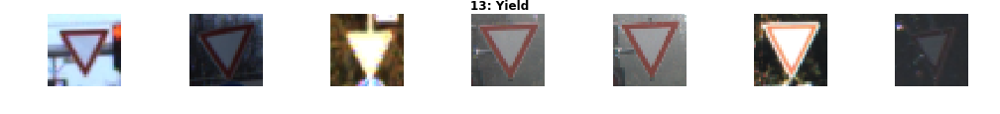

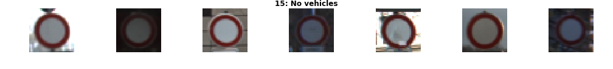
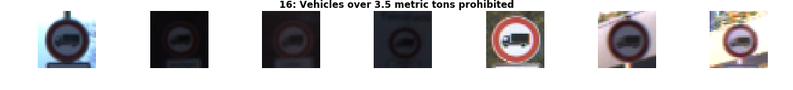

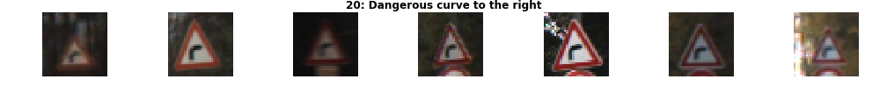
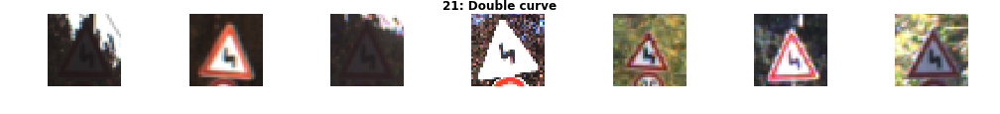
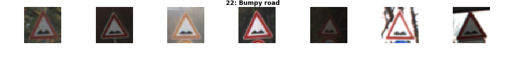
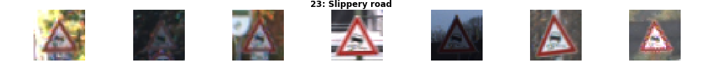

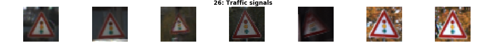
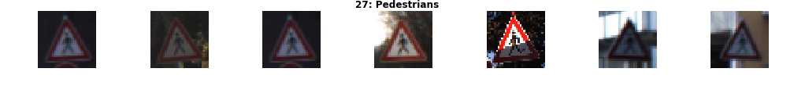
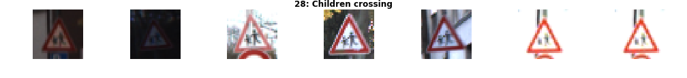
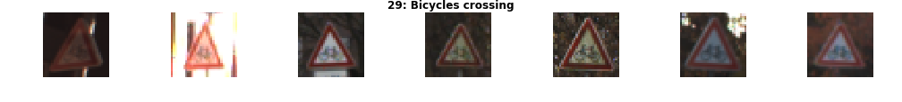
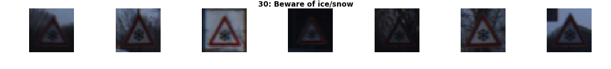

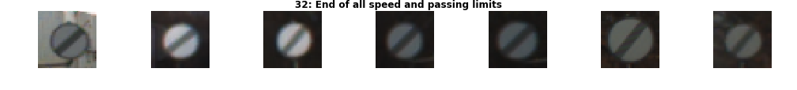
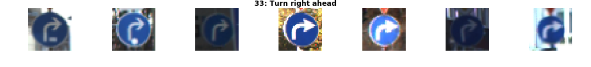

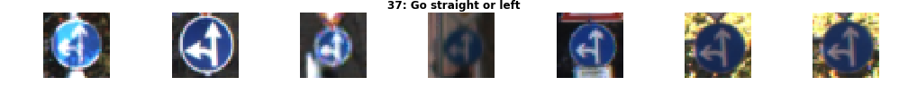

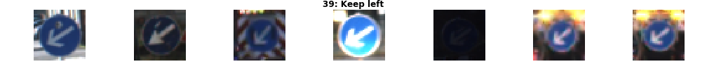

### Design and Test a Model Architecture

#### 1. Describe how you preprocessed the image data. What techniques were chosen and why did you choose these techniques? Consider including images showing the output of each preprocessing technique. Pre-processing refers to techniques such as converting to grayscale, normalization, etc. (OPTIONAL: As described in the "Stand Out Suggestions" part of the rubric, if you generated additional data for training, describe why you decided to generate additional data, how you generated the data, and provide example images of the additional data. Then describe the characteristics of the augmented training set like number of images in the set, number of images for each class, etc.)

I implemented and experimented with several techniques for preprocesing the data:

#### Convert to grayscale

Before:

After:

#### Image generation to balance the classes in the dataset

New images were generated by randomly applying distortions to existing ones. These distortions are:
* Rotation
* Translation
* Shear
* Brightness

Here is the resulting class frequency chart for the training set:
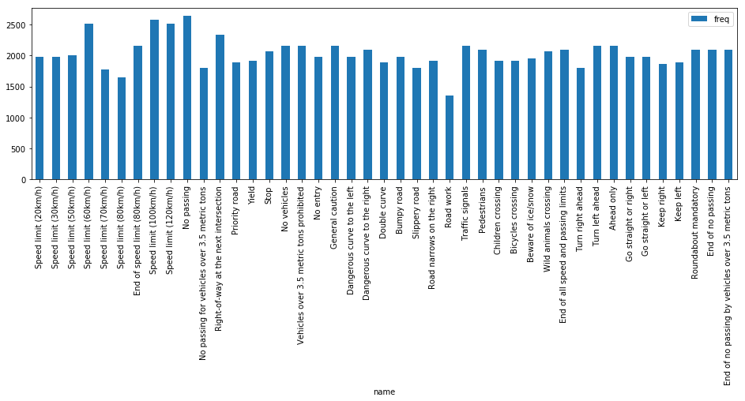

Here is a sample of the generated images:

#### Shuffling the dataset

The complete dataset is shuffled. This was redundant since there is shuffling happening between epochs

#### Brightness improvement

The brighness of the images is improved. Each image is converted to HSV. Then the V channel value is increased to a maximum of 255 to avoid corruption. Finally the image is converted back to BGR.

Sample of brightness corrected images:

Before:

After:

#### Conversion to YUV

Instead of using RGB, images are converted to YUV. The YUV color encoding is documented to allow CNNs to extract features more accurately by blending colors.

Before:

After:

#### Normalization

Images are normalized by deviding to 255.0 and subtracting 0.5.

Before:

After:

#### Applied preprocessing

I experimented with all of the above preprocessing techniques and their combinations. The recipe used in the end is a sequence of
- Improving Brightness
- Converting to YUV
- Normalizing

Here is a sample of the final result

#### 2. Describe what your final model architecture looks like including model type, layers, layer sizes, connectivity, etc.) Consider including a diagram and/or table describing the final model.

My final model consisted of the following layers:

| Layer         		|     Description	        					| 
|:---------------------:|:---------------------------------------------:| 
| Input         		| 32x32x3 YUV image   							| 
| Convolution 5x5     	| 1x1 stride, valid padding, outputs 28x28x6 	|
| Max pooling	      	| 1x1 stride,  outputs 14x14x6 					|
| LRN					|												|
| Convolution 5x5	    | 1x1 stride, valid padding, outputs 10x10x16 	|
| Flatten				| Output 400									|
| Fully connected		| Inputs 400, outputs 120						|
| ReLU					|												|
| Dropout				|												|
| Fully connected		| Inputs 120, outputs 84						|
| ReLU					|												|
| Dropout				|												|
| Fully connected		| Inputs 84, outputs 10							|
| Softmax				| 												|
 

#### 3. Describe how you trained your model. The discussion can include the type of optimizer, the batch size, number of epochs and any hyperparameters such as learning rate.

To train the model I used the Adam optimizer.

I used the following parameters

* Learning rate of 0.001
* 30 epochs (in sets of 10, the model is saved and re-loaded)
* A batch size of 100
* A dropout of 0.75

#### 4. Describe the approach taken for finding a solution and getting the validation set accuracy to be at least 0.93. Include in the discussion the results on the training, validation and test sets and where in the code these were calculated. Your approach may have been an iterative process, in which case, outline the steps you took to get to the final solution and why you chose those steps. Perhaps your solution involved an already well known implementation or architecture. In this case, discuss why you think the architecture is suitable for the current problem.

My final model results were:
* training set accuracy of 1.000
* validation set accuracy of 0.951
* test set accuracy of 0.937

If an iterative approach was chosen:
* What was the first architecture that was tried and why was it chosen?
The initial architecture was the LeNet network exactly as implemented in the corresponding Lab

* What were some problems with the initial architecture?
It failed to achieve accuracy beyond 0.930

* How was the architecture adjusted and why was it adjusted?
I replaced the ReLU activation with LRN after the convolution layers, as per the original LeNet paper.

* Which parameters were tuned? How were they adjusted and why?
All parameters where experimented with, trying larger and smaller values and all combinations. Eventually the ones chosen gave the best accuracy.

* What are some of the important design choices and why were they chosen?
Since I got really bad results by generating extra images, it was important to have a low value of dropout, to avoid overfitting the majority classes. 0.75 gave the best results. Lower values like 0.50 gave really poor accuracy, potentially because it failed to train the minority classes.

If a well known architecture was chosen:
* What architecture was chosen? LeNet
* Why did you believe it would be relevant to the traffic sign application? It performed well in all the cource material leading up to this project
* How does the final model's accuracy on the training, validation and test set provide evidence that the model is working well?
There is a noticeable difference in accuracy between the training set (1.000) and the test set (0.937). This leads me to suspect overfitting, but also that the chosen preprocessing strategy can be further improved.
 

### Test a Model on New Images

#### 1. Choose five German traffic signs found on the web and provide them in the report. For each image, discuss what quality or qualities might be difficult to classify.

Here are five German traffic signs that I found on the web:

       

Most images exhibit ideal characteristics, they are bright and clear. Nonetheless images 5 (20: Dangerous curve to the right) and 7 (31: Wild animals crossing) are darkened with features blending with the background. Also, class 20 was a minority class in the training set, while class 31 had a little below average frequency, but its features are very similar to many other classes.

#### 2. Discuss the model's predictions on these new traffic signs and compare the results to predicting on the test set. At a minimum, discuss what the predictions were, the accuracy on these new predictions, and compare the accuracy to the accuracy on the test set (OPTIONAL: Discuss the results in more detail as described in the "Stand Out Suggestions" part of the rubric).

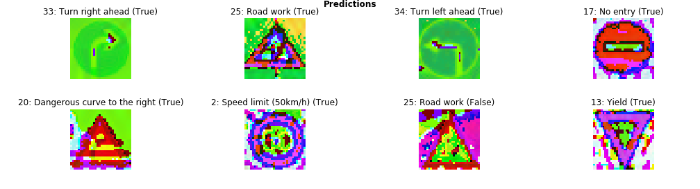

The model was able to correctly guess 7 of the 8 traffic signs, which gives an accuracy of 80%. This is expected and similar to the results from the original test set.

#### 3. Describe how certain the model is when predicting on each of the five new images by looking at the softmax probabilities for each prediction. Provide the top 5 softmax probabilities for each image along with the sign type of each probability. (OPTIONAL: as described in the "Stand Out Suggestions" part of the rubric, visualizations can also be provided such as bar charts)

Here are the results for the top-5 analysis. Notice that the misprediction of class 31, twice the probability that the correct prediction got.

##### 33: Turn right ahead

33: Turn right ahead (17.549)

37: Go straight or left (6.35557)

34: Turn left ahead (4.84145)

35: Ahead only (4.39909)

40: Roundabout mandatory (4.24382)

##### 25: Road work

25: Road work (3.00632)

1: Speed limit (30km/h) (2.70206)

31: Wild animals crossing (0.377192)

5: Speed limit (80km/h) (0.281231)

4: Speed limit (70km/h) (-0.063481)

##### 34: Turn left ahead

34: Turn left ahead (20.3643)

38: Keep right (5.33243)

33: Turn right ahead (4.15459)

13: Yield (3.59759)

35: Ahead only (2.06187)

##### 17: No entry

17: No entry (11.3651)

14: Stop (9.6664)

13: Yield (3.14716)

29: Bicycles crossing (2.13894)

3: Speed limit (60km/h) (1.61154)

##### 20: Dangerous curve to the right

20: Dangerous curve to the right (8.17844)

28: Children crossing (4.86214)

16: Vehicles over 3.5 metric tons prohibited (4.21322)

23: Slippery road (2.29837)

41: End of no passing (2.28515)

##### 2: Speed limit (50km/h)

2: Speed limit (50km/h) (19.566)

5: Speed limit (80km/h) (7.85889)

1: Speed limit (30km/h) (7.10269)

3: Speed limit (60km/h) (6.95838)

7: Speed limit (100km/h) (-2.45611)

##### 31: Wild animals crossing

25: Road work (3.31925)

1: Speed limit (30km/h) (2.92751)

31: Wild animals crossing (1.82274)

2: Speed limit (50km/h) (0.105731)

33: Turn right ahead (-0.187905)

##### 13: Yield

13: Yield (26.0019)

9: No passing (5.26584)

28: Children crossing (-2.48457)

3: Speed limit (60km/h) (-3.06142)

15: No vehicles (-5.39136)

### (Optional) Visualizing the Neural Network (See Step 4 of the Ipython notebook for more details)
#### 1. Discuss the visual output of your trained network's feature maps. What characteristics did the neural network use to make classifications?

The visualization of the feature maps can be seen at the end of the submitted notebook (it was hard to atunatically save those images without huge white margins, but jupyter prints them correctly).

The first convolution extracts the most important fetures, excluding the background and other noise. The second convolution extracts the common minor features that make each image unique. Finally the fully connected layers convert each image into a 1 dimentional sequence of colors that is unique for each class.